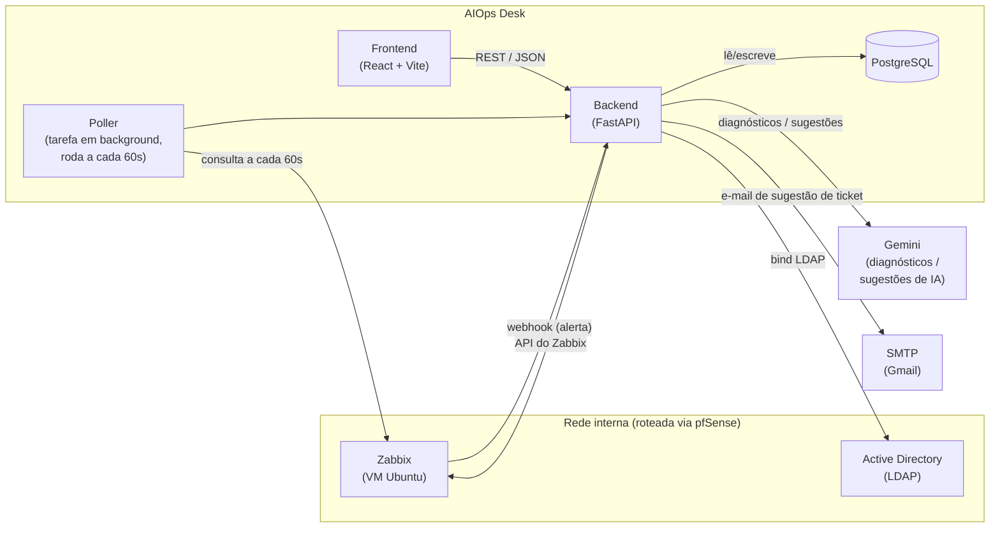

# Arquitetura

[🇺🇸 Read in English](README.md)

O AIOps Desk é uma pequena plataforma de operações: recebe alertas do
Zabbix, permite que uma equipe interna de analistas trate esses alertas
como tickets, usa um modelo de IA (Gemini) pra sugerir diagnóstico e
prioridade, e autentica os analistas contra o Active Directory já existente
da empresa.

## Componentes

- **Backend — FastAPI**: API REST, regras de negócio, consulta ao Zabbix,
  diagnósticos/sugestões gerados por IA, ciclo de vida dos tickets,
  notificações por e-mail, autenticação via LDAP.
- **Banco de dados — PostgreSQL**: armazena tickets, contexto de
  autenticação dos usuários e histórico de diagnósticos. Roda em um
  container Docker (`aiops-desk-db-1`).
- **Frontend — React + Vite + TypeScript**: painel do analista (Login,
  Visão Geral, Diagnóstico, Tickets, Histórico, Zabbix, Consulta AD) além
  de uma página pública "abrir chamado" para usuários finais sem login.
- **Zabbix**: a fonte de verdade do monitoramento. Roda numa VM Ubuntu
  separada, alcançável a partir do backend através do pfSense.
- **Active Directory / LDAP**: autentica os analistas usando as credenciais
  já existentes da empresa, sem precisar de uma base de usuários separada.
- **Gemini (IA)**: gera diagnósticos legíveis (`diagnosticar()`) e
  sugestões estruturadas de ticket — resolução sugerida + prioridade
  (`sugerir_resolucao()`).
- **SMTP (Gmail)**: envia e-mails de sugestão de ticket com links de
  resolução de um clique.

## Fluxo de dados

## Dois caminhos pra um problema do Zabbix virar ticket

1. **Webhook (tempo real)**: o Zabbix chama `POST /webhooks/zabbix`
   (autenticado via header `x-webhook-secret`) assim que um problema
   dispara, e um ticket é criado imediatamente.
2. **Poller (rede de segurança, a cada 60s)**: uma tarefa em background
   (`asyncio.create_task` no startup do FastAPI) checa o Zabbix por
   problemas ativos e cria um ticket pra qualquer um que ainda não tenha um
   (comparado pelo `zabbix_eventid`), caso alguma chamada de webhook tenha
   sido perdida.

Os dois caminhos escrevem na mesma tabela `tickets`, diferenciados por um
campo `origem` (`zabbix` vs. `manual`/formulário público), então o resto do
sistema — painel, destaque de SLA, sugestões de IA, e-mail — não precisa
saber de qual caminho o ticket veio.

## Autenticação

Analistas fazem login com as credenciais já existentes do AD via LDAP. O
backend faz o bind contra o controlador de domínio e, em caso de sucesso,
emite seu próprio token de sessão, usado em todas as chamadas subsequentes
à API — não existe uma base local de senhas para analistas.

## Uso de IA

- `diagnosticar()` — diagnóstico em texto livre (Causa Provável / Passos de
  Diagnóstico / Ação Recomendada), usado por `/diagnostico` e
  `/zabbix/diagnosticar/{eventid}`, exibido na tela de Diagnóstico.
- `sugerir_resolucao()` — saída estruturada em JSON (resolução sugerida +
  prioridade), usada quando um ticket é criado, para preencher
  `sugestao_ia` e `prioridade_ia`.
