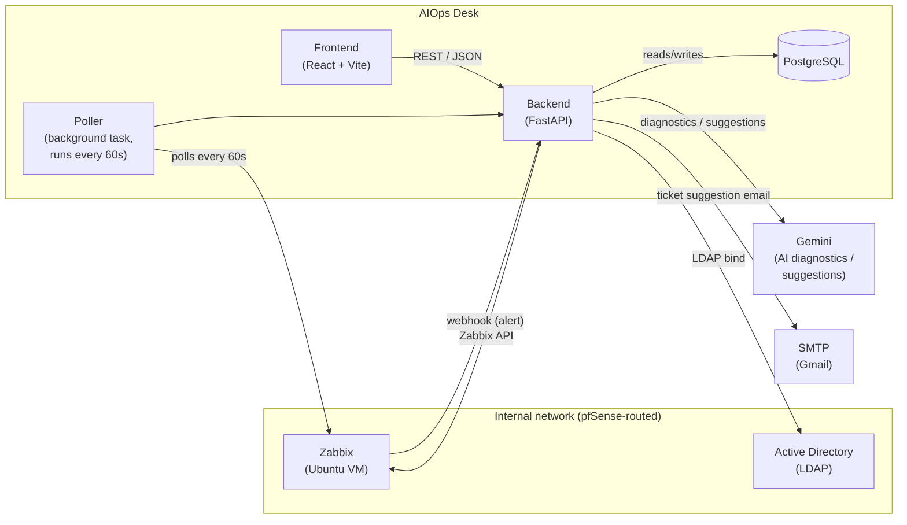

# Architecture

[🇧🇷 Ler em português](README-pt-br.md)

AIOps Desk is a small operations platform: it ingests alerts from Zabbix,
lets an internal analyst team work them as tickets, uses an AI model
(Gemini) to suggest diagnostics and priority, and authenticates analysts
against the company's existing Active Directory.

## Components

- **Backend — FastAPI**: REST API, business logic, Zabbix polling,
  AI-generated diagnostics/suggestions, ticket lifecycle, email
  notifications, LDAP authentication.
- **Database — PostgreSQL**: stores tickets, users' authentication
  context, and diagnostic history. Runs in a Docker container
  (`aiops-desk-db-1`).
- **Frontend — React + Vite + TypeScript**: analyst dashboard (Login,
  Visão Geral, Diagnóstico, Tickets, Histórico, Zabbix, Consulta AD) plus
  a public "open a ticket" page for end users who aren't logged in.
- **Zabbix**: the monitoring source of truth. Runs on a separate Ubuntu VM,
  reachable from the backend through pfSense.
- **Active Directory / LDAP**: authenticates analysts using existing
  company credentials, so there's no separate user database to manage.
- **Gemini (AI)**: generates human-readable diagnostics (`diagnosticar()`)
  and structured ticket suggestions — suggested resolution + priority
  (`sugerir_resolucao()`).
- **SMTP (Gmail)**: sends ticket-suggestion emails with one-click
  resolution links.

## Data flow

## Two ways a Zabbix problem becomes a ticket

1. **Webhook (real-time)**: Zabbix calls `POST /webhooks/zabbix`
   (authenticated via an `x-webhook-secret` header) as soon as a problem
   fires, and a ticket is created immediately.
2. **Poller (safety net, every 60s)**: a background task
   (`asyncio.create_task` at FastAPI startup) checks Zabbix for active
   problems and creates a ticket for any that don't already have one
   (matched by `zabbix_eventid`), in case a webhook call was ever missed.

Both paths write into the same `tickets` table, distinguished by an
`origem` field (`zabbix` vs. `manual`/public form), so the rest of the
system — dashboard, SLA highlighting, AI suggestions, email — doesn't need
to know which path a ticket came from.

## Authentication

Analysts log in with their existing AD credentials over LDAP. The backend
binds against the domain controller, and on success issues its own session
token used for all subsequent API calls — there's no local password store
for analysts.

## AI usage

- `diagnosticar()` — free-text diagnostic (Causa Provável / Passos de
  Diagnóstico / Ação Recomendada), used by `/diagnostico` and
  `/zabbix/diagnosticar/{eventid}`, shown on the Diagnóstico screen.
- `sugerir_resolucao()` — structured JSON output (suggested resolution +
  priority), used when a ticket is created, to pre-fill `sugestao_ia` and
  `prioridade_ia`.
